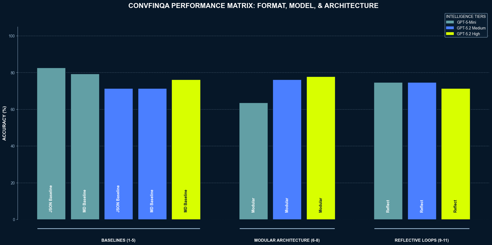
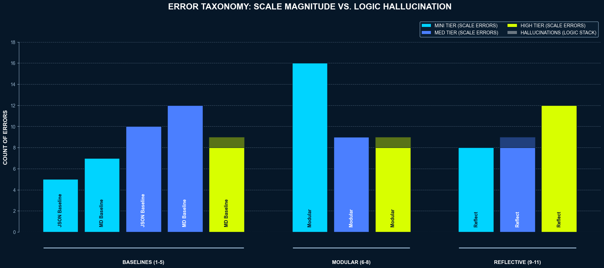
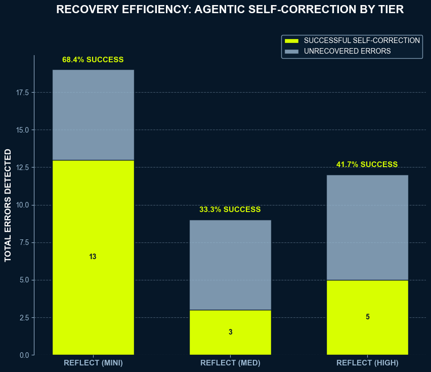
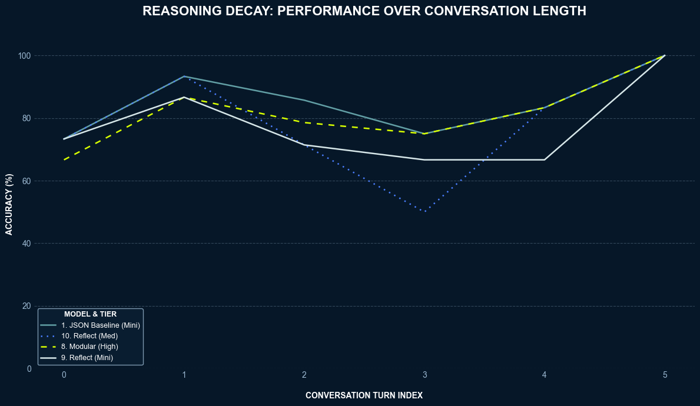

---

# ConvFinQA Analysis Report: A Multiple Agent Ablation Study

## Technical note:

Project uses open AI API. Make sure to create a .env file.  
`echo "OPENAI_API_KEY=your_key_here" > .env`

To run the interactive analyst: `uv run python -m src.main <record_id> --condition <id>`. 
Example:  `uv run python -m src.main "Single_JKHY/2009/page_28.pdf-3" --condition 1`

To run the batch evaluation suite: `uv run python scripts/evaluate.py`.  
Defaults to 15 samples (15 samples, 11 conditions, ~4 turns per sample = ~660 calls), change `SAMPLE` variable in `evaluate.py` to reduce this to 1. 

## 1. Introduction:

This report details the development and evaluation of an agentic framework designed to solve the ConvFinQA challenge. Following an initial exploratory phase to establish prompt-engineering baselines and validate data formatting decisions, I conducted a rigorous 11-condition ablation study to identify the optimal configuration for complex financial reasoning. This study focused on isolating the impact of two key areas:
1.  **Intelligence Tiers:** Evaluating the performance curve across model classes (GPT mini vs. GPT 5.2) and varying levels of internal reasoning effort (Medium and High).
2.  **Architectural Orchestration:** Measuring the performance delta between a Single-Pass simple prompt response, a Modular agent with a Planner and Analyst, and a Reflective agent with a Planner, Analyst and added Reviewer.

The goal of this project was to provide some direction and insight on the best architecture for the task at hand, using rigorous evaluation to go beyond a simple accuracy measure. 

---

## Method

### 1. Data Formatting

#### Long-Context Prompting:

Each record in the ConvFinQA dataset typically falls within the 2k–3k token range, which fits comfortably within the context windows of modern reasoning models. With this in mind I chose to feed this entire context as part of the prompt for the QA task over implementing a retrieval setup.

#### Markdown Hypothesis:
- Decision: 
  - After deciding to use long-context prompting and reviewing the ConvFinQA data, I opted to present the table key–value pairs as a Markdown table instead of native JSON. 

- The rationale:
  - Financial tables can be extremely dense and long, in JSON form it can become difficult to extract values buried in nested key-value pairs, headers could be hundreds of tokens away from values potentially stretching the attention mechanism. In Markdown, they sit side-by-side, with columns vertically aligned by pipes. This allows a planner or thinking state to use this visual grid and identify values using natural language e.g. "The 1st value of the third column". My thinking was that this will allow for richer thinking and planning from the baseline/agents.

To implememnt this I created a `utils/parser.py` and validated it using a 2-tier pipeline to ensure zero loss of data during conversion:
1. **Programmatic Tier:** Fast Python/Regex screening for pipe consistency.
2. **LLM Tier (Semantic Auditor):** A `gpt-5-mini` instance run on flagged failures from the programmatic tier. I also added some false negative defense by auditing a random 5% sample of the successful programmatic checks. 

This two-tier pipeline confirmed no strict data loss. However, it did reveal a minor precision artifact (e.g., -9.0 being simplified to -9). This didnt impact the mathematical logic of the study, but in a production environment I would review ways to mitigate these errors.


### 2. Constraints

#### Deterministic Math Execution:

- Decision:
  - Provided a python maths tool (`src/agent/tools.py`) to ensure deterministic outputs.
- Rationale:
  - LLMs excel at formula creation, but struggle when it comes to actually performing calculations, the results for this QA task must be deterministic so I need to prohibit the LLM from performing any calculations itself. Adding a maths tool lets the LLM create the formula and act as a translator.

#### Pydantic

- Decision:
  - Every state in the pipeline (Planner, Analyst, Reviewer) was bound to a strict Pydantic schema using the OpenAI responses.parse interface. 
- The Rationale:
  - In a multi turn agent enforcing correct formatting from the LLM for the next stage is essential in creating a reliable agent. It reduces parsing errors and also increases token efficiency.


### 3. Hierarchical XML Prompts
- Decision:
  - I moved from flat text instructions to a structured XML tagging system (<persona>, <operational_directives>, <output_contract>).
- Rationale:
  - Context Separation: Financial contexts (tables/text) can be very dense. Using XML tags helps the model clearly distinguish between the data it’s analysing and the rules it must follow.
  - Modular Prompting: This structure allowed me to easily swap directives between the Baseline and Agentic versions while keeping the core persona consistent.

#### Prompt Engineering:

Before moving onto the creation of the full agent (planner, analyst, reviewer) I  performed an initial eval on a baseline single pass prompt -> response using a prompt generated by an LLM. I then used a human-in-the-loop approach to engineer the prompt based on error analysis from a few small sample runs. I found four common failures during this.

- Scaling issues: 
  - Initial runs showed the model converting values like "10.5 million" to the full integer (10,500,000). Since the dataset expects the shorthand provided in the source table, I added a directive to use numbers exactly as they appear.
  
- Name Error failures: 
  - Had many cases of Name Error failures due to the model producing variable names that the maths tool couldnt use. To prevent this, I added instructions to try and force every value in the expression to be a literal float or an ans_N variable.

- Model performing calculations:
  -  I observed cases of the model performing calculations in the reasoning field and then outputting a static number. Again added instruction via a role to force the model to define the formula.


Following implementation of this prompt engineering our baseline single prompt agent went from a ~40% accuracy to roughly %80.  
Doing a quick investigation into the turn based accuracy I found that the initial model fell from 90% accuracy to ~65% by turn 3, this seemed to be a good indication that a more sophisticated agent might achieve better turn by turn accuracy.

---

### 4. Ablation Study & Production Refactoring

To find the optimal production configuration, I conducted an iterative architectural evaluation across 11 conditions. While structured like a reverse ablation study, it followed an additive 'staircase' approach with the aim of finding the point at which increased reasoning and architectural complexity stopped yielding an accuracy increase.

### The Experimental Matrix
I mapped three tiers of intelligence against three tiers of orchestration:
1.  **Efficiency Tier (gpt-5-mini):** Optimised for cost and extraction speed.
2.  **Standard Tier (gpt-5.2 Medium):** Balancing reasoning depth with performance.
3.  **Ceiling Tier (gpt-5.2 High):** Testing the maximum reasoning capability of the system.

**Scientific Controls:**
*   **Deterministic Sampling:** Every condition was evaluated against the exact same 15 records using a fixed `Random Seed (42)`.
*   **Separated Architecture:** Where possible I aimed to change one varaible per condition so as to maintain interpretability of the results. Ultimately I set up three groups of conditions to make sure that each addition to the agent could be measured.

| Group | Cond | Name | Rationale |
| :--- | :---: | :--- | :--- |
| **Baselines** | 1 | JSON Baseline (Mini) | GPT 5 mini with JSON as a baseline |
| | 2 | MD Baseline (Mini) | GPT 5 mini with markdown as a baseline |
| | 3 | JSON Baseline (Med) | GPT 5.2 med thinking effort with JSON as a baseline |
| | 4 | MD Baseline (Med) | GPT 5.2 med thinking effort with markdown as a baseline |
| | 5 | MD Baseline (High) |  GPT 5.2 High thinking effort with JSON as a baseline |
| **Modular** | 6 | Modular (Mini) | Planner/Analyst setup on GPT 5 mini, markdown |
| | 7 | Modular (Med) | Planner/Analyst setup on GPT 5.2, markdown, med effort |
| | 8 | Modular (High) | Planner/Analyst setup on GPT 5.2, markdown, high effort |
| **Reflective**| 9 | Reflect (Mini) | Full agent Planner/Analyst/Reviewer setup on GPT 5 mini, markdown |
| | 10 | Reflect (Med) | Full agent Planner/Analyst/Reviewer setup on GPT 5.2, markdown, med effort |
| | 11 | Reflect (High) | Full agent Planner/Analyst/Reviewer setup on GPT 5.2, markdown, high effort |

### Group Rationales

#### 1. Baselines (1–5):
- Aim of this group, establish a baseline and learn whether changing the data format (JSON to Markdown) or increasing the model tier actually helps the model.

#### 2. Modular Architecture (6–8):
- This group tested the ROI of separating the single prompt into two distinct states, a planner/analyst. This group would tell me whether this increased complexity would aid the turn 3 accuracy decay.

#### 3. Reflective Loops (9–11):
- The final group introduced a Reviewer state to identify and fix errors. This group represents the highest token cost and latency. The goal was to determine if the accuracy boost of self-correction justified the increase in API calls, particularly for the smaller "mini" tier.
&nbsp;


### The Production-Grade Refactor
As the complexity of the study grew, I migrated the codebase from a a few flat execution scripts to a modular, Production-Grade Architecture:

*   Separation of Concerns:
    *    I decoupled the system into distinct modules: `ReasoningClient` (API logic), `ContextBuilder` (Data prep), `MathTool` (Execution), and `ConvFinQAManager` (Orchestration).
*   Pydantic:
    *    Using Pydantic, I enforced strict schemas for all agent hand-offs. This eliminated parsing errors and ensured that the Analyst always received valid "Coordinates of Truth" from the Planner.
*   Communication and Logging:
    *    I implemented a dual-stream logging system. While the console provided high-level progress via `Rich`, the background `evaluation.log` captured raw reasoning traces. This was the "key" for error analysis in Section 5.
*   Error Handling:
    *    I implemented fallback logic for model or parsing failures ensuring a single malformed response wouldn't crash a long-running evaluation batch.

Following refactoring I performed a quick initial test of the evaluator on the final condition (11) to make sure that each state was working correctly and took this testing opportunity to do some small prompt engineering on the new states prior to running the full evaluate script.

---

### 5. Error Analysis:

The most significant finding during development was discovering a Positive Bias Conflict in the reviwer. 

#### Self Sabotage
During the testing of Condition 11 (Reflect High), I saw occasions where the  Reviewer state degraded accuracy. Using the raw reasoning traces from the `ReasoningClient`, I found the following scenario:

1.  **Analyst State:** Corrected for sign integrity instructions and generated the mathematically correct negative expression (e.g. `ans_0 / ans_1 = -0.5`).
2.  **Auditor State:** Flagged the negative sign as a failure. Despite the XML instructions, the Reviewer seemed to have a bias where a "difference" or "decrease" should be described as a positive.
3.  **Self-Correction:** The Analyst, deferring to the Auditor’s feedback, "fixed" the expression to a positive value, turning a successful result into an error.

Despite a quick round of prompt engineering to fix this, the reviewer consistently tried to correct negative numbers to positive. This is something that I could change for next time by introducing dynamic prompting depending on whether a negative sign has been produced in any of the ans_N results.


---

### 6. Results




 
Figure 1: Bar chart to show overall accuracy of all conditions across all turns.

### Key Takeaways
*   Condition 1 (gpt-5 mini - native json single prompt) achieved the highest accuracy of 83%
*   Adding a planner/analyst to gpt-mini (cond 5) caused a drastic reduction in accuracy - ~64%.
*   Adding back in reflection seemed to fix some of this lost accuracy, but had little to no effect on the gpt-5.2 Med and High thinking effort conditions.
*   Increased complexity and model tier did not result in noticeable overall increases to accuracy.

&nbsp;

---

&nbsp;
&nbsp;



Figure 2: Error taxonomy of the failed turns

### Key Takeaways
* Scale errors were prevalent throughout each condition.
* Very little hallucinations.  Interestingly hallucinations only occured in the high reasoning effort conditions

---

&nbsp;



Figure 2: Reviewer correction rate for each reflection condition.

### Key Takeaways
*   **Best Error Correction:** `9. Reflect (Mini)` with a **68.4% recovery rate**, successfully catching errors that other architectures missed.

---

&nbsp;



Figure 2: By turn accuracy for the best performing models.

### Key Takeaways
*   Increasing architecture complexity and model tier did not improve the chain decay observed in the initial baseline.


---

### --- Category Performance ---
```
             mean   std    max
Category                      
Baseline    76.19  4.89  82.54
Modular     72.49  7.83  77.78
Reflective  73.54  1.83  74.60

--- Tier Performance ---
Tier
gpt-5.2 (High Thinking)      75.133333
gpt-5-mini                   75.000000
gpt-5.2 (Medium Thinking)    73.412500
Name: accuracy, dtype: float64

Correlation between Scale Errors and Accuracy: -0.96
```
*   **Intelligence Tier Comparison:** The gap between **GPT-5-Mini (75.0%)** and **GPT-5.2 High Thinking (75.1%)** is negligible. Paying for High Thinking offers diminishing returns compared to an optimised Mini baseline.


---

### 7. Discussion

This section critically examines the core design decisions, their limitations, and what the results reveal about LLM behavior in multi-turn financial reasoning tasks.

#### 7.1 The DSL Constraint:

The decision to enforce a Domain-Specific Language (DSL) for mathematical expressions—requiring the model to output Python expressions in a strict format (e.g., `(ans_0 - ans_1) / ans_2`) was a mistake upon reflection. This approach artificially constrained the model's reasoning capabilities in several ways:

1. **Limited Freedom:** The DSL restricted the model to a narrow set of operations, preventing it from using conditional logic, string manipulation, or more complex mathematical reasoning that might be natural for certain questions.

2. **Error Amplification:** The strict formatting requirements (literal floats and ans_N variables only) created a new category of failures. Many "Name Error" failures in the error taxonomy weren't mathematical mistakes—they were formatting violations where the model understood the problem correctly but violated DSL syntax rules.

3. **Cognitive Overhead:** Rather than letting the model focus on reasoning about financial concepts, it had to simultaneously reason about the answer AND translate that reasoning into a constrained syntax. This dual task likely contributed to the performance degradation observed in later conversation turns.

**Why This Approach Was Chosen:**
The DSL was implemented to ensure deterministic mathematical execution—a valid goal given that LLMs are unreliable at arithmetic. I needed the LLM's reasoning capabilities but couldn't trust its calculation abilities. The DSL was meant to bridge this gap, but it did so by limiting the reasoning I were trying to harness.

**Alternative Approaches:**
A more robust solution would involve:
- **Tool-use APIs:** Allowing the model to call calculation functions with natural parameters rather than constructing constrained expressions
- **Multi-step validation:** Letting the model propose a calculation strategy in natural language, then having a separate step translate this to executable code
- **Hybrid systems:** Using symbolic reasoning engines for the mathematical component while letting the LLM handle semantic understanding and value extraction


#### 7.2 The Markdown Hypothesis: Misaligned Assumptions

**The Assumption:**
The rationale for converting JSON tables to Markdown (Section 2, lines 35-40) was that "visual alignment" would help the model identify values using spatial reasoning (e.g., "the 1st value of the third column"). This assumed the model processes text with some notion of visual structure.

**The Reality:**
This assumption is likely incorrect. Transformer models process text as token sequences, not visual grids. While certain positional encodings capture sequence order, there's no evidence that Markdown's pipe-delimited columns provide meaningful "visual" advantages over well-structured JSON when both are tokenized. The model doesn't "see" vertical alignment—it processes a linear stream of tokens.

**What The Data Shows:**
The results don't support the Markdown hypothesis. Conditions comparing JSON vs Markdown at the same model tier showed marginal or inconsistent differences:
- Condition 1 (JSON Baseline Mini): 83% accuracy—the highest overall
- Condition 2 (MD Baseline Mini): Lower accuracy despite the supposed "visual" advantage

This suggests that format choice may be less important than other factors (prompt quality, model capability, task decomposition), or that JSON's structured nature actually aids the model in certain ways that offset any supposed Markdown benefits.

**Lesson:**
Validate a hypothesis before going ahead with it. 

#### 7.3 Architectural Complexity and Diminishing Returns

**The Modular Penalty:**
The shift from baseline (single-prompt) to modular architecture (Planner + Analyst) caused a significant accuracy drop—from 76.2% to 72.5%. This is counterintuitive: decomposing the task into specialized components should theoretically improve performance.

**Hypotheses for the Performance Drop:**

1. **Context Fragmentation:** By splitting the task across multiple agent calls, I fragmented the reasoning context. The Analyst received "coordinates" from the Planner but lost the holistic view of the problem that a single-pass model maintains.

2. **Error Propagation:** In the modular setup, Planner errors cascade into Analyst failures. A single-pass model can self-correct mid-reasoning, but once the Planner outputs incorrect coordinates, the Analyst has no recovery path.

3. **Prompt Overhead:** Each agent state required additional prompt scaffolding (role definitions, output schemas, handoff protocols). This consumed context budget that could have been used for examples or reasoning.

4. **Over-Engineering:** The task may not have been complex enough to benefit from decomposition. For simpler financial questions, a well-prompted single model can handle both planning and execution effectively.

**The Reflection Paradox:**
Adding the Reviewer (Conditions 9-11) partially recovered lost accuracy, which seems to validate the reviewer as a valuable addition to the pipeline. It indicates that an ideal setup would be an initial large single plan and execute prompt followed by a single reviewer (two steps) as opposed to the modular 3 step process.

#### 7.4 Model Tier and Reasoning Effort: Ceiling Effects

**The Surprising Finding:**
GPT-5-Mini (75.0%) and GPT-5.2 High Thinking (75.1%) showed negligible performance differences. This contradicts the intuition that "better models with more reasoning should perform better."

**Possible Explanations:**

1. **Task Ceiling:** The ConvFinQA task may not sufficiently challenge frontier model capabilities. If the limiting factor is prompt design, data formatting, or DSL constraints rather than reasoning depth, upgrading the model won't help.

2. **Over-Thinking:** Higher reasoning effort might actually hurt performance on this task. If the model overthinks straightforward numerical lookups or second-guesses simple arithmetic, extended reasoning could introduce errors rather than corrections.

3. **Evaluation Noise:** With only 15 samples, small differences may not be statistically significant. The apparent parity could be measurement noise rather than true equivalence.

4. **Wrong Capabilities Tested:** The task emphasizes value extraction and formula construction—capabilities that even smaller models handle well. It doesn't stress the reasoning abilities where GPT-5.2 excels (complex multi-hop inference, abstract reasoning, edge case handling).

**Trade-off Analysis:**
From a production standpoint, this finding is valuable: if GPT-5-Mini matches GPT-5.2 High at a fraction of the cost and latency, the choice is clear. However, it also suggests the system isn't effectively leveraging the capabilities of advanced models—a sign that the task formulation or architecture may be suboptimal.

#### 7.5 Error Analysis and LLM Failure Modes

**Scale Errors (-0.96 Correlation with Accuracy):**
The near-perfect negative correlation between scale errors and accuracy reveals a systematic failure mode. The model struggles to maintain numerical scale consistency (millions vs. thousands vs. raw numbers) across conversation turns. This isn't a reasoning failure—the model likely understands the relationships correctly—but a value representation failure.

**Why This Happens:**
1. **Inconsistent Grounding:** Tables present values as "10.5" with separate column headers indicating "$ millions". The model must maintain this scale annotation across turns, but this metadata gets lost as the conversation progresses.

2. **Reference Ambiguity:** When questions refer to "that value" from turn N-2, the model must retrieve both the number AND its scale. The DSL format doesn't encode scale metadata, so even correct arithmetic on wrong scales produces failures.

3. **Prompt Brittleness:** The directive to "use numbers exactly as they appear" (added during initial prompt engineering) helped avoid over-expansion (10.5M → 10,500,000) but created the opposite problem: the model became too literal and lost scale awareness.

**Hallucinations in High Reasoning Conditions:**
Interestingly, hallucinations only appeared in high reasoning effort conditions. This seems paradoxical, more reasoning should reduce errors, but it suggests that extended reasoning without proper grounding can lead the model to confabulate values or relationships that seem logically consistent but aren't supported by the source document.

**Reviewer Positive Bias Conflict:**
The Reviewer's tendency to "fix" mathematically correct negative values (Section 5) reveals how implicit biases in frontier models can sabotage explicit instructions. Despite XML directives to validate mathematical correctness, the Reviewer appeared to have a learned prior that "decreases" should be positive percentages—a common financial reporting convention that contradicted the task requirements.

This failure mode is particularly insidious because it's a form of "helpful" behavior gone wrong: the model is trying to follow financial domain conventions it learned during pre-training, overriding the specific task instructions.

#### 7.6 What This Study Reveals About LLM System Design

**Key Lessons:**

1. **Simplicity Often Wins:** The best-performing condition was a simple, single-pass prompt with minimal architectural overhead. Adding sophisticated multi-agent orchestration decreased performance until I added even more complexity to fix it.

2. **Constraints Can Backfire:** The DSL constraint, while ensuring deterministic math, created new failure modes and limited the model's natural reasoning capabilities.

3. **Assumptions Require Validation:** The Markdown hypothesis seemed plausible but wasn't validated by results, highlighting the need for empirical testing rather than intuition-driven design.

4. **Model Capabilities ≠ Task Performance:** Access to frontier models (GPT-5.2) didn't translate to better outcomes, suggesting the bottleneck was system design rather than model capability.

5. **Error Analysis Reveals System Weaknesses:** The scale error correlation and reviewer bias were only discovered through careful error analysis—surface-level accuracy metrics alone wouldn't have revealed these systematic issues.

**Implications for Future Work:**
Rather than further architectural complexity, improvements should focus on:
- Redesigning the math execution interface to avoid DSL constraints
- Implementing scale-aware value tracking across conversation turns
- Using simpler prompts with better examples rather than more sophisticated agent orchestration
- Conducting larger-scale evaluations to validate findings and reduce noise

---

### 8. Further Work

#### 8.1 Redesign Math Execution Interface

As discussed in Section 7.1, the DSL approach is fundamentally brittle. Future work should explore:

- **Natural Language Tool Calls:** Allow the model to describe calculations in natural language, then parse these into executable functions
- **Structured Tool APIs:** Provide explicit calculation tools (add, subtract, divide, etc.) that the model can call with named parameters rather than constructing expression strings
- **Validation Layers:** Implement a separate validation step that checks whether the proposed calculation semantically matches the question before execution

This would eliminate DSL-related Name Errors and allow the model to focus on reasoning rather than syntax compliance.

#### 8.2 Scale-Aware Value Tracking

Given the -0.96 correlation between scale errors and accuracy, implementing robust scale tracking is critical:

- **Metadata Preservation:** When extracting values from tables, capture and preserve scale annotations (millions, thousands, percentages)
- **Contextual Scale Resolution:** Implement a system that tracks which scale each `ans_N` variable represents, then enforces consistency in subsequent calculations
- **Scale Verification Prompts:** Before final answer submission, explicitly prompt the model to verify that output scales match expected units

#### 8.3 Full-Scale Evaluation

This study evaluated only 15 records per condition (~60 turns total), limiting statistical confidence. A full evaluation would:

- Run all 11 conditions across the complete test set (434 conversations)
- Enable statistical significance testing between conditions
- Reveal whether observed patterns (e.g., model tier parity, modular architecture penalty) hold at scale
- Allow for more granular error analysis across conversation types (Type I vs Type II)

#### 8.4 Simplified Architecture with Targeted Reflection

Rather than adding architectural complexity, future iterations should:

- Start with the best-performing baseline (Condition 1: GPT-5-Mini JSON)
- Add only the reflection layer (based on Condition 9's 68.4% correction rate)
- Skip the modular Planner/Analyst decomposition that decreased performance
- Focus prompt engineering effort on the baseline and reviewer prompts rather than orchestration scaffolding

This "asymmetric" approach would maintain simplicity while capturing the benefits of self-correction. 

---
